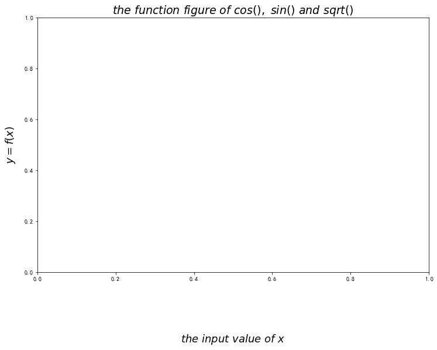

```python
%matplotlib inline
import numpy as np
import matplotlib.pyplot as plt
from pylab import *
%config ZMQInteractiveShell.ast_node_interactivity='all'
%pprint
```

    Pretty printing has been turned OFF


```python
#coding:utf-8

# 定义数据部分
x = np.arange(0., 10, 0.2)
y1 = np.cos(x)
y2 = np.sin(x)
y3 = np.sqrt(x)

# 绘制 3 条函数曲线
plt.plot(x, y1, color='blue', linewidth=1.5, linestyle='-', marker='.', label=r'$y = cos{x}$')
plt.plot(x, y2, color='green', linewidth=1.5, linestyle='-', marker='*', label=r'$y = sin{x}$')
plt.plot(x, y3, color='m', linewidth=1.5, linestyle='-', marker='x', label=r'$y = \sqrt{x}$')

# 坐标轴上移
ax = plt.subplot(111)
ax.spines['right'].set_color('none')     # 去掉右边的边框线
ax.spines['top'].set_color('none')       # 去掉上边的边框线

# 移动下边边框线，相当于移动 X 轴
ax.xaxis.set_ticks_position('bottom')    
ax.spines['bottom'].set_position(('data', 0))

# 移动左边边框线，相当于移动 y 轴
ax.yaxis.set_ticks_position('left')
ax.spines['left'].set_position(('data', 0))

# 设置 x, y 轴的取值范围
plt.xlim(x.min()*1.1, x.max()*1.1)
plt.ylim(-1.5, 4.0)

# 设置 x, y 轴的刻度值
plt.xticks([2, 4, 6, 8, 10], [r'2', r'4', r'6', r'8', r'10'])
plt.yticks([-1.0, 0.0, 1.0, 2.0, 3.0, 4.0], 
    [r'-1.0', r'0.0', r'1.0', r'2.0', r'3.0', r'4.0'])

# 添加文字
plt.text(8, 1.5, r'$x \in [0.0, \ 10.0]$', color='k', fontsize=15)
plt.text(8, 1.8, r'$y \in [-1.0, \ 4.0]$', color='k', fontsize=15)

# 特殊点添加注解
plt.scatter([8,],[np.sqrt(8),], 50, color ='m')  # 使用散点图放大当前点
plt.annotate(r'$2\sqrt{2}$', xy=(8, np.sqrt(8)), xytext=(8.5, 2.2), fontsize=16, color='#090909', arrowprops=dict(arrowstyle='->', connectionstyle='arc3, rad=0.1', color='#090909'))

# 设置标题、x轴、y轴
plt.title(r'$the \ function \ figure \ of \ cos(), \ sin() \ and \ sqrt()$', fontsize=19)
plt.xlabel(r'$the \ input \ value \ of \ x$', fontsize=18, labelpad=88.8)
plt.ylabel(r'$y = f(x)$', fontsize=18, labelpad=12.5)

# 设置图例及位置
plt.legend(loc='best')    
# plt.legend(['cos(x)', 'sin(x)', 'sqrt(x)'], loc='up right')

# 显示网格线
plt.grid(True)    

# 显示绘图
plt.show()
```


    [<matplotlib.lines.Line2D object at 0x129958510>]


    [<matplotlib.lines.Line2D object at 0x129958b50>]


    [<matplotlib.lines.Line2D object at 0x129282610>]


    /Users/flybird/opt/anaconda3/lib/python3.7/site-packages/ipykernel_launcher.py:15: MatplotlibDeprecationWarning: Adding an axes using the same arguments as a previous axes currently reuses the earlier instance.  In a future version, a new instance will always be created and returned.  Meanwhile, this warning can be suppressed, and the future behavior ensured, by passing a unique label to each axes instance.
      from ipykernel import kernelapp as app


    (0.0, 10.780000000000001)


    (-1.5, 4.0)


    ([<matplotlib.axis.XTick object at 0x129a454d0>, <matplotlib.axis.XTick object at 0x129a3bc50>, <matplotlib.axis.XTick object at 0x129285150>, <matplotlib.axis.XTick object at 0x129282b90>, <matplotlib.axis.XTick object at 0x1292667d0>], <a list of 5 Text xticklabel objects>)


    ([<matplotlib.axis.YTick object at 0x129a45d50>, <matplotlib.axis.YTick object at 0x129a3bc10>, <matplotlib.axis.YTick object at 0x12925d790>, <matplotlib.axis.YTick object at 0x12925dcd0>, <matplotlib.axis.YTick object at 0x12925df10>, <matplotlib.axis.YTick object at 0x129282c10>], <a list of 6 Text yticklabel objects>)


    Text(8, 1.5, '$x \\in [0.0, \\ 10.0]$')


    Text(8, 1.8, '$y \\in [-1.0, \\ 4.0]$')


    <matplotlib.collections.PathCollection object at 0x127d38ad0>


    Text(8.5, 2.2, '$2\\sqrt{2}$')


    Text(0.5, 1.0, '$the \\ function \\ figure \\ of \\ cos(), \\ sin() \\ and \\ sqrt()$')


    Text(0.5, 0, '$the \\ input \\ value \\ of \\ x$')


    Text(0, 0.5, '$y = f(x)$')


    <matplotlib.legend.Legend object at 0x12925d8d0>


# 具体细节画法

## 准备数据


```python
x = np.arange(0.,10,0.2) # 生成从0开始,间隔为0.2,到10的数列
x
```


    array([0. , 0.2, 0.4, 0.6, 0.8, 1. , 1.2, 1.4, 1.6, 1.8, 2. , 2.2, 2.4,
           2.6, 2.8, 3. , 3.2, 3.4, 3.6, 3.8, 4. , 4.2, 4.4, 4.6, 4.8, 5. ,
           5.2, 5.4, 5.6, 5.8, 6. , 6.2, 6.4, 6.6, 6.8, 7. , 7.2, 7.4, 7.6,
           7.8, 8. , 8.2, 8.4, 8.6, 8.8, 9. , 9.2, 9.4, 9.6, 9.8])


```python
y1 = np.cos(x)
y2 = np.sin(x)
y3 = np.sqrt(x)
```

## 绘制基本曲线


```python
plt.rcParams['figure.figsize'] = (12,8) #配置画布
"""
linewidth:宽度,
linestyle:线的形状
marker:每个点的标注
label:标签
"""
plt.plot(x,y1,color='blue',linewidth=1.5,linestyle=':',marker='.',label=r'$y = cos{x}$')
plt.plot(x, y2, color='green', linewidth=1.5, linestyle='--', marker='*', label=r'$y = sin{x}$')
plt.plot(x, y3, color='m', linewidth=1.5, linestyle='-.', marker='x', label=r'$y = \sqrt{x}$')
```


    '\nlinewidth:宽度,\nlinestyle:线的形状\nmarker:每个点的标注\nlabel:标签\n'


    [<matplotlib.lines.Line2D object at 0x12991a9d0>]


    [<matplotlib.lines.Line2D object at 0x129920ed0>]


    [<matplotlib.lines.Line2D object at 0x1290cef50>]


## 设置坐标轴


```python
ax = plt.subplot(111)
ax.spines['right'].set_color('none') #去掉右边边框
ax.spines['top'].set_color('none')       # 去掉上边的边框线
# 移动下边边框线，相当于移动 X 轴
ax.xaxis.set_ticks_position('bottom')    
ax.spines['bottom'].set_position(('data', 0))
# 移动左边边框线，相当于移动 y 轴
ax.yaxis.set_ticks_position('left')
ax.spines['left'].set_position(('data', 0))
```


```python
#xlim就是设置x轴的刻度取值范围,ylim也一样
plt.xlim(x.min()*1.1,x.max()*1.1)
plt.ylim(-1.5,4.0)

#设置x,y轴的刻度标签值
plt.xticks([2,4,6,8,10],['two','four','six','8','10'])
plt.yticks([-1.0, 0.0, 1.0, 2.0, 3.0, 4.0],[r'-1.0', r'0.0', r'1.0', r'2.0', r'3.0', r'4.0'])
```


    (0.0, 10.780000000000001)


    (-1.5, 4.0)


    ([<matplotlib.axis.XTick object at 0x1298ec050>, <matplotlib.axis.XTick object at 0x1298e07d0>, <matplotlib.axis.XTick object at 0x1298e0950>, <matplotlib.axis.XTick object at 0x12916f390>, <matplotlib.axis.XTick object at 0x12916f9d0>], <a list of 5 Text xticklabel objects>)


    ([<matplotlib.axis.YTick object at 0x1298dd110>, <matplotlib.axis.YTick object at 0x1290d5590>, <matplotlib.axis.YTick object at 0x1298e0910>, <matplotlib.axis.YTick object at 0x129170610>, <matplotlib.axis.YTick object at 0x12916f610>, <matplotlib.axis.YTick object at 0x129170710>], <a list of 6 Text yticklabel objects>)


## 设置标题,x轴,y轴


```python
plt.title(r'$the \ function \ figure \ of \ cos(), \ sin() \ and \ sqrt()$', fontsize=19)
plt.xlabel(r'$the \ input \ value \ of \ x$', fontsize=18, labelpad=88.8)
plt.ylabel(r'$y = f(x)$', fontsize=18, labelpad=12.5)
```


    Text(0.5, 1.0, '$the \\ function \\ figure \\ of \\ cos(), \\ sin() \\ and \\ sqrt()$')


    Text(0.5, 0, '$the \\ input \\ value \\ of \\ x$')


    Text(0, 0.5, '$y = f(x)$')





## 设置文字描述,注解


```python
plt.text(0.8, 0.8, r'$y \in [-1.0, \ 4.0]$', color='k', fontsize=15)
```


    Text(0.8, 0.8, '$y \\in [-1.0, \\ 4.0]$')


```python
plt.legend(['cos(x)', 'sin(x)', 'sqrt(x)'], loc='upper right')
```


    <matplotlib.legend.Legend object at 0x129955a50>


```python
# 特殊点添加注解
plt.scatter([8,],[np.sqrt(8),], 50, color ='m')  # 使用散点图放大当前点
plt.annotate(r'$2\sqrt{2}$', xy=(8, np.sqrt(8)), xytext=(8.002, 2.83), fontsize=16, color='#090909', arrowprops=dict(arrowstyle='->', connectionstyle='arc3, rad=0.1', color='#090909'))
```


    <matplotlib.collections.PathCollection object at 0x129198690>


    Text(8.002, 2.83, '$2\\sqrt{2}$')


## 显示网格


```python
plt.grid(True)
```


# 其他常用图形


```python
# 和dataframe自带的matplot差不多
```

## 曲线图


```python
x = np.arange(-5,5,0.1)
y = x ** 2
plt.plot(x,y, color='blue', linewidth=1.5, linestyle='-', marker='.', label=r'$y = x**2 $')
# 坐标轴上移
ax = plt.subplot(111)
ax.spines['right'].set_color('none')     # 去掉右边的边框线
ax.spines['top'].set_color('none')       # 去掉上边的边框线

# 移动下边边框线，相当于移动 X 轴
ax.xaxis.set_ticks_position('bottom')    
ax.spines['bottom'].set_position(('data', 0))

# 移动左边边框线，相当于移动 y 轴
ax.yaxis.set_ticks_position('left')
ax.spines['left'].set_position(('data', 0))

plt.annotate(r'$2^2$', xy=(2, np.power(2,2)), xytext=(4, 10), fontsize=16, color='#090909', arrowprops=dict(arrowstyle='->', connectionstyle='arc3, rad=0.1', color='#090909'))
plt.show()
```


    [<matplotlib.lines.Line2D object at 0x12d0bb910>]


    /Users/flybird/opt/anaconda3/lib/python3.7/site-packages/ipykernel_launcher.py:5: MatplotlibDeprecationWarning: Adding an axes using the same arguments as a previous axes currently reuses the earlier instance.  In a future version, a new instance will always be created and returned.  Meanwhile, this warning can be suppressed, and the future behavior ensured, by passing a unique label to each axes instance.
      """


    Text(4, 10, '$2^2$')


## 直方图


```python
x = np.random.normal(size=1000)
plt.hist(x, bins=10)
```


    (array([  5.,  13.,  52., 158., 203., 250., 191.,  91.,  31.,   6.]), array([-3.15751873, -2.5500038 , -1.94248886, -1.33497393, -0.727459  ,
           -0.11994407,  0.48757086,  1.0950858 ,  1.70260073,  2.31011566,
            2.91763059]), <a list of 10 Patch objects>)


## 散点图


```python
plt.rcParams["figure.figsize"] = (8,8)
x = np.random.normal(size=1000)
y = np.random.normal(size=1000)
plt.scatter(x,y)
```


    <matplotlib.collections.PathCollection object at 0x12d450190>


## 箱式图


```python
plt.rcParams["figure.figsize"] = (8,8)
x = np.random.normal(size=100)
plt.boxplot(x)
```


    {'whiskers': [<matplotlib.lines.Line2D object at 0x12d5b2910>, <matplotlib.lines.Line2D object at 0x12d6d6a50>], 'caps': [<matplotlib.lines.Line2D object at 0x12d6d6f10>, <matplotlib.lines.Line2D object at 0x12d6becd0>], 'boxes': [<matplotlib.lines.Line2D object at 0x12d5bd390>], 'medians': [<matplotlib.lines.Line2D object at 0x12d438a10>], 'fliers': [<matplotlib.lines.Line2D object at 0x12d6dccd0>], 'means': []}


```python

```
