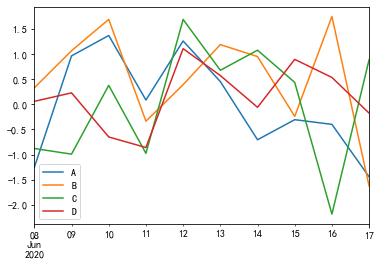
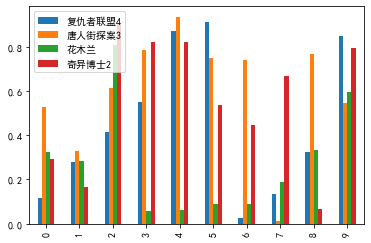
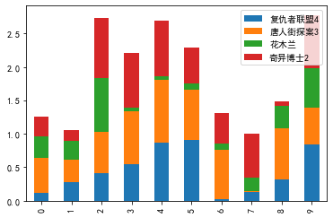
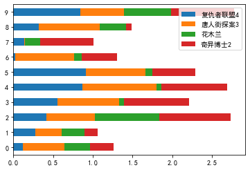
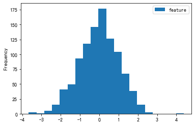
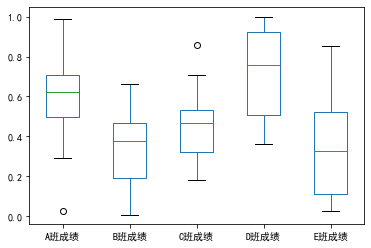
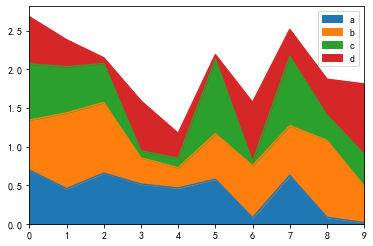
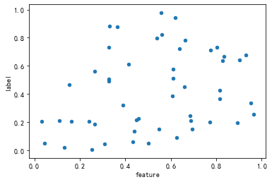
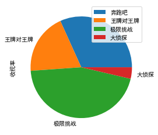

```python
%matplotlib inline
%config ZMQInteractiveShell.ast_node_interactivity='all'
%pprint
```

    Pretty printing has been turned OFF


# 折线图


```python
import pandas as pd
import numpy as np

# 模拟数据,创建10条样本4维特征(ABCD)的数据集,index用日期
df = pd.DataFrame(np.random.randn(10,4),index=pd.date_range('2020/06/08',periods=10),columns=list('ABCD'))
df
# 生成折线图
df.plot()
# df.plot(kind='bar')
# df.plot(kind='scatter')
```


<div>
<style scoped>
    .dataframe tbody tr th:only-of-type {
        vertical-align: middle;
    }

    .dataframe tbody tr th {
        vertical-align: top;
    }

    .dataframe thead th {
        text-align: right;
    }
</style>
<table border="1" class="dataframe">
  <thead>
    <tr style="text-align: right;">
      <th></th>
      <th>A</th>
      <th>B</th>
      <th>C</th>
      <th>D</th>
    </tr>
  </thead>
  <tbody>
    <tr>
      <th>2020-06-08</th>
      <td>-1.256140</td>
      <td>0.331681</td>
      <td>-0.880322</td>
      <td>0.061060</td>
    </tr>
    <tr>
      <th>2020-06-09</th>
      <td>0.968628</td>
      <td>1.071634</td>
      <td>-0.992868</td>
      <td>0.230597</td>
    </tr>
    <tr>
      <th>2020-06-10</th>
      <td>1.375745</td>
      <td>1.697399</td>
      <td>0.380643</td>
      <td>-0.649762</td>
    </tr>
    <tr>
      <th>2020-06-11</th>
      <td>0.087308</td>
      <td>-0.334914</td>
      <td>-0.977338</td>
      <td>-0.860840</td>
    </tr>
    <tr>
      <th>2020-06-12</th>
      <td>1.266327</td>
      <td>0.393977</td>
      <td>1.696335</td>
      <td>1.112964</td>
    </tr>
    <tr>
      <th>2020-06-13</th>
      <td>0.456152</td>
      <td>1.193928</td>
      <td>0.681915</td>
      <td>0.576355</td>
    </tr>
    <tr>
      <th>2020-06-14</th>
      <td>-0.705553</td>
      <td>0.954845</td>
      <td>1.081903</td>
      <td>-0.057589</td>
    </tr>
    <tr>
      <th>2020-06-15</th>
      <td>-0.304646</td>
      <td>-0.239415</td>
      <td>0.439627</td>
      <td>0.899465</td>
    </tr>
    <tr>
      <th>2020-06-16</th>
      <td>-0.398573</td>
      <td>1.756117</td>
      <td>-2.190107</td>
      <td>0.538051</td>
    </tr>
    <tr>
      <th>2020-06-17</th>
      <td>-1.446475</td>
      <td>-1.630590</td>
      <td>0.894601</td>
      <td>-0.174813</td>
    </tr>
  </tbody>
</table>
</div>


    <matplotlib.axes._subplots.AxesSubplot object at 0x129dc4450>





# 条形图


```python
df = pd.DataFrame(np.random.rand(10,4),columns=['复仇者联盟4','唐人街探案3','花木兰','奇异博士2'])
df
#条形图做票房比较
df.plot.bar()
#生成一个堆积条形图
df.plot.bar(stacked=True)
#改变方向
df.plot.barh(stacked=True)
```


<div>
<style scoped>
    .dataframe tbody tr th:only-of-type {
        vertical-align: middle;
    }

    .dataframe tbody tr th {
        vertical-align: top;
    }

    .dataframe thead th {
        text-align: right;
    }
</style>
<table border="1" class="dataframe">
  <thead>
    <tr style="text-align: right;">
      <th></th>
      <th>复仇者联盟4</th>
      <th>唐人街探案3</th>
      <th>花木兰</th>
      <th>奇异博士2</th>
    </tr>
  </thead>
  <tbody>
    <tr>
      <th>0</th>
      <td>0.118044</td>
      <td>0.526496</td>
      <td>0.323379</td>
      <td>0.293442</td>
    </tr>
    <tr>
      <th>1</th>
      <td>0.280432</td>
      <td>0.328256</td>
      <td>0.284089</td>
      <td>0.167527</td>
    </tr>
    <tr>
      <th>2</th>
      <td>0.414533</td>
      <td>0.611081</td>
      <td>0.807015</td>
      <td>0.901476</td>
    </tr>
    <tr>
      <th>3</th>
      <td>0.551647</td>
      <td>0.783280</td>
      <td>0.059502</td>
      <td>0.820269</td>
    </tr>
    <tr>
      <th>4</th>
      <td>0.870089</td>
      <td>0.936150</td>
      <td>0.059633</td>
      <td>0.823406</td>
    </tr>
    <tr>
      <th>5</th>
      <td>0.912574</td>
      <td>0.747624</td>
      <td>0.089175</td>
      <td>0.537429</td>
    </tr>
    <tr>
      <th>6</th>
      <td>0.027621</td>
      <td>0.739693</td>
      <td>0.090274</td>
      <td>0.447850</td>
    </tr>
    <tr>
      <th>7</th>
      <td>0.134759</td>
      <td>0.013764</td>
      <td>0.189735</td>
      <td>0.669381</td>
    </tr>
    <tr>
      <th>8</th>
      <td>0.321824</td>
      <td>0.764795</td>
      <td>0.331842</td>
      <td>0.066525</td>
    </tr>
    <tr>
      <th>9</th>
      <td>0.846412</td>
      <td>0.544712</td>
      <td>0.593776</td>
      <td>0.795212</td>
    </tr>
  </tbody>
</table>
</div>


    <matplotlib.axes._subplots.AxesSubplot object at 0x12c2e80d0>


    <matplotlib.axes._subplots.AxesSubplot object at 0x12c3af210>


    <matplotlib.axes._subplots.AxesSubplot object at 0x12c5282d0>











# 直方图


```python
df = pd.DataFrame({'feature':np.random.randn(1000)})
df.info()
df.head(5)
df.plot.hist(bins=20)
```

    <class 'pandas.core.frame.DataFrame'>
    RangeIndex: 1000 entries, 0 to 999
    Data columns (total 1 columns):
    feature    1000 non-null float64
    dtypes: float64(1)
    memory usage: 7.9 KB


<div>
<style scoped>
    .dataframe tbody tr th:only-of-type {
        vertical-align: middle;
    }

    .dataframe tbody tr th {
        vertical-align: top;
    }

    .dataframe thead th {
        text-align: right;
    }
</style>
<table border="1" class="dataframe">
  <thead>
    <tr style="text-align: right;">
      <th></th>
      <th>feature</th>
    </tr>
  </thead>
  <tbody>
    <tr>
      <th>0</th>
      <td>0.670657</td>
    </tr>
    <tr>
      <th>1</th>
      <td>-0.590187</td>
    </tr>
    <tr>
      <th>2</th>
      <td>-0.423085</td>
    </tr>
    <tr>
      <th>3</th>
      <td>-1.675163</td>
    </tr>
    <tr>
      <th>4</th>
      <td>-1.817425</td>
    </tr>
  </tbody>
</table>
</div>


    <matplotlib.axes._subplots.AxesSubplot object at 0x12ec2f590>





# 箱型图


```python
df = pd.DataFrame(np.random.rand(10, 5), columns=['A班成绩', 'B班成绩', 'C班成绩', 'D班成绩', 'E班成绩'])
df.describe() #基本统计信息
df.plot.box()
```


<div>
<style scoped>
    .dataframe tbody tr th:only-of-type {
        vertical-align: middle;
    }

    .dataframe tbody tr th {
        vertical-align: top;
    }

    .dataframe thead th {
        text-align: right;
    }
</style>
<table border="1" class="dataframe">
  <thead>
    <tr style="text-align: right;">
      <th></th>
      <th>A班成绩</th>
      <th>B班成绩</th>
      <th>C班成绩</th>
      <th>D班成绩</th>
      <th>E班成绩</th>
    </tr>
  </thead>
  <tbody>
    <tr>
      <th>count</th>
      <td>10.000000</td>
      <td>10.000000</td>
      <td>10.000000</td>
      <td>10.000000</td>
      <td>10.000000</td>
    </tr>
    <tr>
      <th>mean</th>
      <td>0.582264</td>
      <td>0.340856</td>
      <td>0.461718</td>
      <td>0.719934</td>
      <td>0.345009</td>
    </tr>
    <tr>
      <th>std</th>
      <td>0.274306</td>
      <td>0.197198</td>
      <td>0.211051</td>
      <td>0.230717</td>
      <td>0.278886</td>
    </tr>
    <tr>
      <th>min</th>
      <td>0.026729</td>
      <td>0.008439</td>
      <td>0.181963</td>
      <td>0.361501</td>
      <td>0.024241</td>
    </tr>
    <tr>
      <th>25%</th>
      <td>0.494674</td>
      <td>0.190826</td>
      <td>0.320654</td>
      <td>0.508575</td>
      <td>0.112023</td>
    </tr>
    <tr>
      <th>50%</th>
      <td>0.620649</td>
      <td>0.374526</td>
      <td>0.467427</td>
      <td>0.759728</td>
      <td>0.327723</td>
    </tr>
    <tr>
      <th>75%</th>
      <td>0.706988</td>
      <td>0.468149</td>
      <td>0.533545</td>
      <td>0.925188</td>
      <td>0.522213</td>
    </tr>
    <tr>
      <th>max</th>
      <td>0.987089</td>
      <td>0.663396</td>
      <td>0.860336</td>
      <td>0.999177</td>
      <td>0.850675</td>
    </tr>
  </tbody>
</table>
</div>


    <matplotlib.axes._subplots.AxesSubplot object at 0x12c3e7990>





# 区域块图


```python
df = pd.DataFrame(np.random.rand(10, 4), columns=['a', 'b', 'c', 'd'])
df.head()
df.plot.area()
```


<div>
<style scoped>
    .dataframe tbody tr th:only-of-type {
        vertical-align: middle;
    }

    .dataframe tbody tr th {
        vertical-align: top;
    }

    .dataframe thead th {
        text-align: right;
    }
</style>
<table border="1" class="dataframe">
  <thead>
    <tr style="text-align: right;">
      <th></th>
      <th>a</th>
      <th>b</th>
      <th>c</th>
      <th>d</th>
    </tr>
  </thead>
  <tbody>
    <tr>
      <th>0</th>
      <td>0.694434</td>
      <td>0.647196</td>
      <td>0.729172</td>
      <td>0.610592</td>
    </tr>
    <tr>
      <th>1</th>
      <td>0.456321</td>
      <td>0.979929</td>
      <td>0.597875</td>
      <td>0.348582</td>
    </tr>
    <tr>
      <th>2</th>
      <td>0.656594</td>
      <td>0.914542</td>
      <td>0.503719</td>
      <td>0.075140</td>
    </tr>
    <tr>
      <th>3</th>
      <td>0.514629</td>
      <td>0.338971</td>
      <td>0.089659</td>
      <td>0.648028</td>
    </tr>
    <tr>
      <th>4</th>
      <td>0.463233</td>
      <td>0.263455</td>
      <td>0.125294</td>
      <td>0.319243</td>
    </tr>
  </tbody>
</table>
</div>


    <matplotlib.axes._subplots.AxesSubplot object at 0x12c1fc0d0>





# 散点图


```python
df = pd.DataFrame(np.random.rand(50, 2), columns=['feature', 'label'])
df.plot.scatter(x='feature', y='label')
```


    <matplotlib.axes._subplots.AxesSubplot object at 0x12a3fa410>





# 饼状图


```python
df = pd.DataFrame(np.random.randn(4,1),index=['奔跑吧','王牌对王牌','极限挑战','大侦探'],columns=['收视率'])
df.plot.pie(subplots=True)
```


    array([<matplotlib.axes._subplots.AxesSubplot object at 0x12f0fb310>],
          dtype=object)





```python

```
