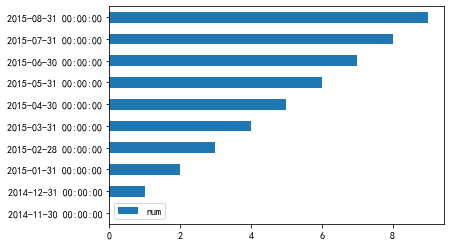
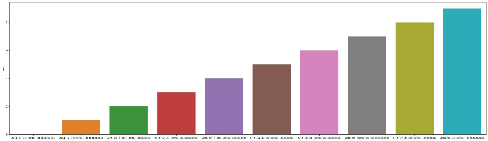

# 导包


```python
"""Tutorial for using pandas and the InfluxDB client."""

import argparse
import pandas as pd

from influxdb import DataFrameClient
```

# 配置


```python
user = 'root'
password = 'root'
dbname = 'demo'
protocol = 'line'
port = 8086
host = '127.0.0.1'
client = DataFrameClient(host, port, user, password, dbname)
```

# 创建dataframe数据


```python
df = pd.DataFrame(data=list(range(10)),index=pd.date_range(start='2014-11-16',periods=10, freq='M'), columns=['num'])
df.head(5)
# print("Create database: " + dbname)
# client.create_database(dbname)

```


<div>
<style scoped>
    .dataframe tbody tr th:only-of-type {
        vertical-align: middle;
    }

    .dataframe tbody tr th {
        vertical-align: top;
    }

    .dataframe thead th {
        text-align: right;
    }
</style>
<table border="1" class="dataframe">
  <thead>
    <tr style="text-align: right;">
      <th></th>
      <th>num</th>
    </tr>
  </thead>
  <tbody>
    <tr>
      <th>2014-11-30</th>
      <td>0</td>
    </tr>
    <tr>
      <th>2014-12-31</th>
      <td>1</td>
    </tr>
    <tr>
      <th>2015-01-31</th>
      <td>2</td>
    </tr>
    <tr>
      <th>2015-02-28</th>
      <td>3</td>
    </tr>
    <tr>
      <th>2015-03-31</th>
      <td>4</td>
    </tr>
  </tbody>
</table>
</div>


# 使用dataframe画图


```python
df.plot.barh()
```


    <matplotlib.axes._subplots.AxesSubplot at 0x1a27407c90>





# 使用snsborn画图


```python
import seaborn as sns
import matplotlib.pyplot as plt
plt.figure(figsize=(28,8))
sns.barplot(y=df['num'],x=df.index)
```


    <matplotlib.axes._subplots.AxesSubplot at 0x1a271da1d0>





# 创建database


```python
client.create_database(dbname)
```

# 写入数据库 


```python
client.write_points(df, 'demo', protocol=protocol)
```


    True


# 添加标签


```python
print("Write DataFrame with Tags")
client.write_points(df, 'demo',{'k1': 'v1', 'k2': 'v2'}, protocol=protocol)
```

    Write DataFrame with Tags


    True


# 使用sql语句查询


```python
client.query("select * from demo limit 10")
```


    defaultdict(list,
                {'demo':                              k1    k2  num
                 2014-11-30 00:00:00+00:00  None  None    0
                 2014-11-30 00:00:00+00:00    v1    v2    0
                 2014-12-31 00:00:00+00:00  None  None    1
                 2014-12-31 00:00:00+00:00    v1    v2    1
                 2015-01-31 00:00:00+00:00  None  None    2
                 2015-01-31 00:00:00+00:00    v1    v2    2
                 2015-02-28 00:00:00+00:00  None  None    3
                 2015-02-28 00:00:00+00:00    v1    v2    3
                 2015-03-31 00:00:00+00:00  None  None    4
                 2015-03-31 00:00:00+00:00    v1    v2    4})


# 删除database


```python
client.drop_database(dbname)
```


```python

```
