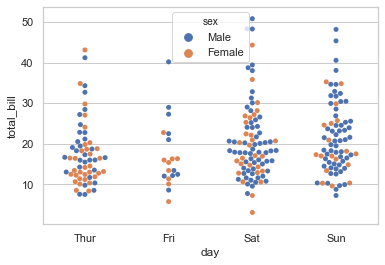
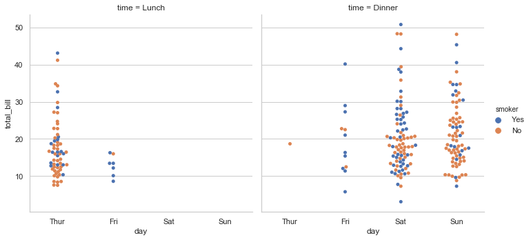

```python
%matplotlib inline
import numpy as np
import pandas as pd
import matplotlib as mpl
import matplotlib.pyplot as plt
import seaborn as sns
sns.set(style="whitegrid", color_codes=True)
import warnings
warnings.filterwarnings("ignore")
np.random.seed(2017)
%config ZMQInteractiveShell.ast_node_interactivity='all'
%pprint
```

    Pretty printing has been turned ON


```python
# sns.load_dataset如果报错 请参考 https://blog.csdn.net/weixin_44957635/article/details/105837182 或者 https://www.pianshen.com/article/54661198161/'
```


```python
titanic = sns.load_dataset("titanic")
tips = sns.load_dataset("tips")
iris = sns.load_dataset("iris")
```

# Seaborn分析数据

## 查看数据


```python
titanic
sns.barplot(x="sex", y="survived", hue="class", data=titanic)
```


<div>
<style scoped>
    .dataframe tbody tr th:only-of-type {
        vertical-align: middle;
    }

    .dataframe tbody tr th {
        vertical-align: top;
    }

    .dataframe thead th {
        text-align: right;
    }
</style>
<table border="1" class="dataframe">
  <thead>
    <tr style="text-align: right;">
      <th></th>
      <th>survived</th>
      <th>pclass</th>
      <th>sex</th>
      <th>age</th>
      <th>sibsp</th>
      <th>parch</th>
      <th>fare</th>
      <th>embarked</th>
      <th>class</th>
      <th>who</th>
      <th>adult_male</th>
      <th>deck</th>
      <th>embark_town</th>
      <th>alive</th>
      <th>alone</th>
    </tr>
  </thead>
  <tbody>
    <tr>
      <th>0</th>
      <td>0</td>
      <td>3</td>
      <td>male</td>
      <td>22.0</td>
      <td>1</td>
      <td>0</td>
      <td>7.2500</td>
      <td>S</td>
      <td>Third</td>
      <td>man</td>
      <td>True</td>
      <td>NaN</td>
      <td>Southampton</td>
      <td>no</td>
      <td>False</td>
    </tr>
    <tr>
      <th>1</th>
      <td>1</td>
      <td>1</td>
      <td>female</td>
      <td>38.0</td>
      <td>1</td>
      <td>0</td>
      <td>71.2833</td>
      <td>C</td>
      <td>First</td>
      <td>woman</td>
      <td>False</td>
      <td>C</td>
      <td>Cherbourg</td>
      <td>yes</td>
      <td>False</td>
    </tr>
    <tr>
      <th>2</th>
      <td>1</td>
      <td>3</td>
      <td>female</td>
      <td>26.0</td>
      <td>0</td>
      <td>0</td>
      <td>7.9250</td>
      <td>S</td>
      <td>Third</td>
      <td>woman</td>
      <td>False</td>
      <td>NaN</td>
      <td>Southampton</td>
      <td>yes</td>
      <td>True</td>
    </tr>
    <tr>
      <th>3</th>
      <td>1</td>
      <td>1</td>
      <td>female</td>
      <td>35.0</td>
      <td>1</td>
      <td>0</td>
      <td>53.1000</td>
      <td>S</td>
      <td>First</td>
      <td>woman</td>
      <td>False</td>
      <td>C</td>
      <td>Southampton</td>
      <td>yes</td>
      <td>False</td>
    </tr>
    <tr>
      <th>4</th>
      <td>0</td>
      <td>3</td>
      <td>male</td>
      <td>35.0</td>
      <td>0</td>
      <td>0</td>
      <td>8.0500</td>
      <td>S</td>
      <td>Third</td>
      <td>man</td>
      <td>True</td>
      <td>NaN</td>
      <td>Southampton</td>
      <td>no</td>
      <td>True</td>
    </tr>
    <tr>
      <th>...</th>
      <td>...</td>
      <td>...</td>
      <td>...</td>
      <td>...</td>
      <td>...</td>
      <td>...</td>
      <td>...</td>
      <td>...</td>
      <td>...</td>
      <td>...</td>
      <td>...</td>
      <td>...</td>
      <td>...</td>
      <td>...</td>
      <td>...</td>
    </tr>
    <tr>
      <th>886</th>
      <td>0</td>
      <td>2</td>
      <td>male</td>
      <td>27.0</td>
      <td>0</td>
      <td>0</td>
      <td>13.0000</td>
      <td>S</td>
      <td>Second</td>
      <td>man</td>
      <td>True</td>
      <td>NaN</td>
      <td>Southampton</td>
      <td>no</td>
      <td>True</td>
    </tr>
    <tr>
      <th>887</th>
      <td>1</td>
      <td>1</td>
      <td>female</td>
      <td>19.0</td>
      <td>0</td>
      <td>0</td>
      <td>30.0000</td>
      <td>S</td>
      <td>First</td>
      <td>woman</td>
      <td>False</td>
      <td>B</td>
      <td>Southampton</td>
      <td>yes</td>
      <td>True</td>
    </tr>
    <tr>
      <th>888</th>
      <td>0</td>
      <td>3</td>
      <td>female</td>
      <td>NaN</td>
      <td>1</td>
      <td>2</td>
      <td>23.4500</td>
      <td>S</td>
      <td>Third</td>
      <td>woman</td>
      <td>False</td>
      <td>NaN</td>
      <td>Southampton</td>
      <td>no</td>
      <td>False</td>
    </tr>
    <tr>
      <th>889</th>
      <td>1</td>
      <td>1</td>
      <td>male</td>
      <td>26.0</td>
      <td>0</td>
      <td>0</td>
      <td>30.0000</td>
      <td>C</td>
      <td>First</td>
      <td>man</td>
      <td>True</td>
      <td>C</td>
      <td>Cherbourg</td>
      <td>yes</td>
      <td>True</td>
    </tr>
    <tr>
      <th>890</th>
      <td>0</td>
      <td>3</td>
      <td>male</td>
      <td>32.0</td>
      <td>0</td>
      <td>0</td>
      <td>7.7500</td>
      <td>Q</td>
      <td>Third</td>
      <td>man</td>
      <td>True</td>
      <td>NaN</td>
      <td>Queenstown</td>
      <td>no</td>
      <td>True</td>
    </tr>
  </tbody>
</table>
<p>891 rows × 15 columns</p>
</div>


    <matplotlib.axes._subplots.AxesSubplot at 0x1a2483e9d0>


```python
## 分类散点图 当有一维数据是分类数据时，散点图成为了条带形状。
# sns.scatterplot(x="day", y="total_bill", data=tips)
```

## 散点图


```python
sns.stripplot(x="day", y="total_bill", data=tips,jitter=True) #jitter是抖动功能,因为一维的时候,有可能是条带形状
```


    <matplotlib.axes._subplots.AxesSubplot at 0x1a21a06a50>


## 蜂窝图


```python
#蜂窝图就是抖动的散点图,适合一维
```


```python
sns.swarmplot(x="day", y="total_bill", data=tips)
```


    <matplotlib.axes._subplots.AxesSubplot at 0x1a219f3250>


## 如果是增加一个空间维度,比如每一个一级分类下面再分二级分类的时候可以用hue


```python
sns.swarmplot(x="day", y="total_bill", hue="sex", data=tips)
```


    <matplotlib.axes._subplots.AxesSubplot at 0x1a21a5aed0>





## 箱图


```python
sns.boxplot(x="day", y="total_bill", hue="time", data=tips)
```


    <matplotlib.axes._subplots.AxesSubplot at 0x1a1ff5e050>


## violin图, violin有点像violin形状的barh图


```python
sns.violinplot(x='total_bill',y='day',hue='time',data=tips)
```


    <matplotlib.axes._subplots.AxesSubplot at 0x1a25823d10>


```python
sns.violinplot(x="total_bill", y="day", hue="time", data=tips, bw=.1, scale="count", scale_hue=False)
```


    <matplotlib.axes._subplots.AxesSubplot at 0x1a25644050>


## 非对称violin图


```python
sns.violinplot(x="day", y="total_bill", hue="sex", data=tips, split=True, inner="stick")
```


    <matplotlib.axes._subplots.AxesSubplot at 0x1a25204590>


## 柱状图


```python
sns.barplot(x='sex',y='survived',hue='class',data=titanic,ci=None)
```


    <matplotlib.axes._subplots.AxesSubplot at 0x1a269ef850>


## 灰度柱状图-等于pandas的value counts


```python
sns.countplot(x="deck", data=titanic)
```


    <matplotlib.axes._subplots.AxesSubplot at 0x1a26d11dd0>


## 点图


```python
sns.pointplot(x="sex", y="survived", hue="class", data=titanic)
```


    <matplotlib.axes._subplots.AxesSubplot at 0x1a2734df10>


## 分类子图


```python
tips.head()
```


<div>
<style scoped>
    .dataframe tbody tr th:only-of-type {
        vertical-align: middle;
    }

    .dataframe tbody tr th {
        vertical-align: top;
    }

    .dataframe thead th {
        text-align: right;
    }
</style>
<table border="1" class="dataframe">
  <thead>
    <tr style="text-align: right;">
      <th></th>
      <th>total_bill</th>
      <th>tip</th>
      <th>sex</th>
      <th>smoker</th>
      <th>day</th>
      <th>time</th>
      <th>size</th>
    </tr>
  </thead>
  <tbody>
    <tr>
      <th>0</th>
      <td>16.99</td>
      <td>1.01</td>
      <td>Female</td>
      <td>No</td>
      <td>Sun</td>
      <td>Dinner</td>
      <td>2</td>
    </tr>
    <tr>
      <th>1</th>
      <td>10.34</td>
      <td>1.66</td>
      <td>Male</td>
      <td>No</td>
      <td>Sun</td>
      <td>Dinner</td>
      <td>3</td>
    </tr>
    <tr>
      <th>2</th>
      <td>21.01</td>
      <td>3.50</td>
      <td>Male</td>
      <td>No</td>
      <td>Sun</td>
      <td>Dinner</td>
      <td>3</td>
    </tr>
    <tr>
      <th>3</th>
      <td>23.68</td>
      <td>3.31</td>
      <td>Male</td>
      <td>No</td>
      <td>Sun</td>
      <td>Dinner</td>
      <td>2</td>
    </tr>
    <tr>
      <th>4</th>
      <td>24.59</td>
      <td>3.61</td>
      <td>Female</td>
      <td>No</td>
      <td>Sun</td>
      <td>Dinner</td>
      <td>4</td>
    </tr>
  </tbody>
</table>
</div>


```python
sns.factorplot(x='day',y='total_bill',hue='smoker',col='time',data=tips,kind='swarm')
# col用来分类
```


    <seaborn.axisgrid.FacetGrid at 0x1a279b8710>





## 大杂烩图


```python
sns.pairplot(data=tips,hue='smoker')
```


    <seaborn.axisgrid.PairGrid at 0x1a2685b150>


```python

```
